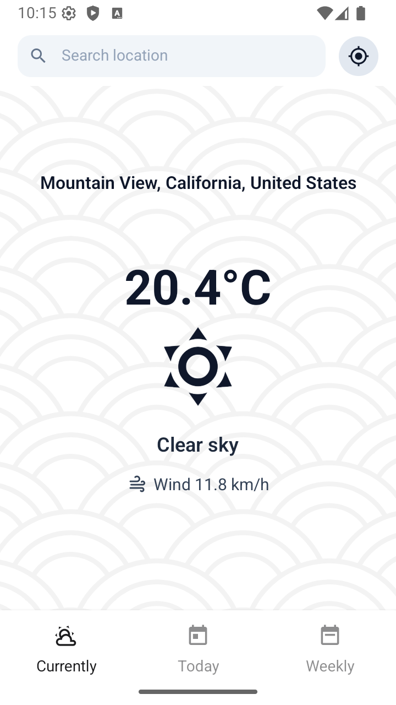
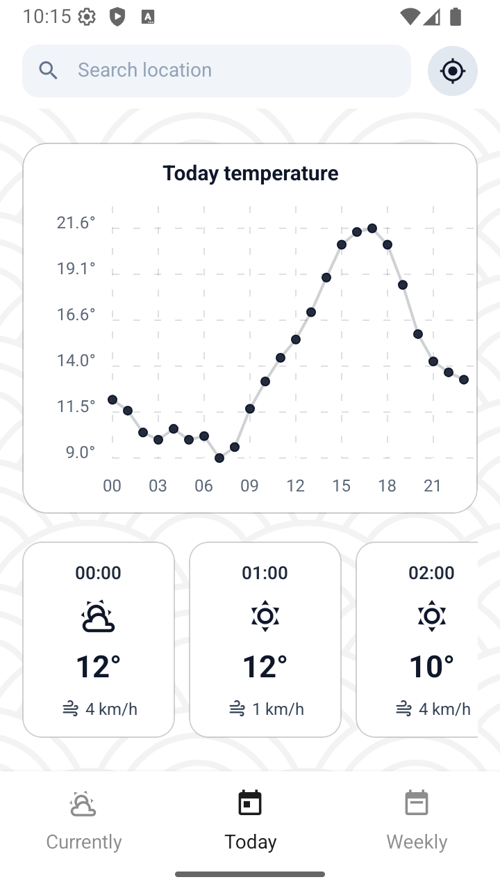
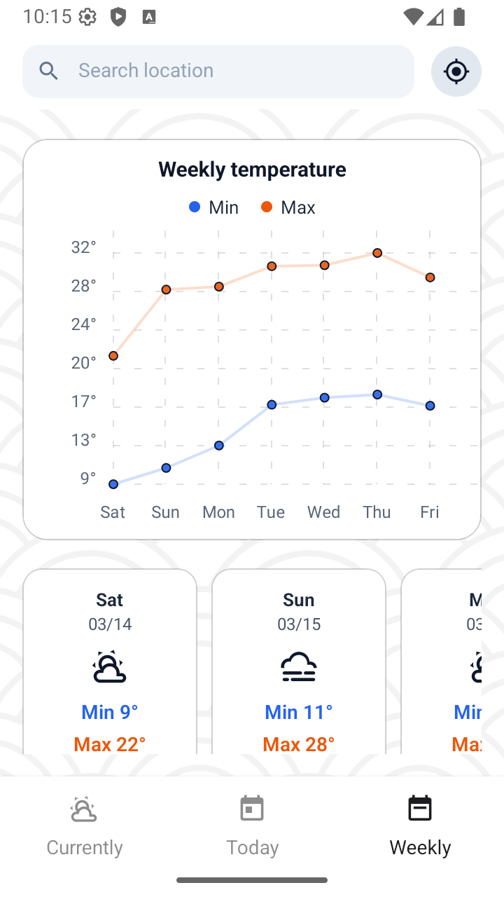

# mobileModule03 - Weather App

## Overview
A weather app built with Expo / React Native. Select a location via GPS or city search to view current, today, and weekly forecasts. Data is fetched from the Open-Meteo Geocoding and Forecast APIs.

This module is part of the Mobile Development specialization of the 42 curriculum.

## Screenshots

  
  
  

## Features
- Current location weather via GPS button
- City search with autocomplete suggestions
- Current conditions (temperature, icon, wind speed)
- Today’s hourly forecast (line chart + cards)
- Weekly forecast (min/max line chart + daily cards)
- Auto-retry search when network reconnects

## Tech Stack
- Expo + React Native + Expo Router
- Open-Meteo API (Geocoding / Forecast)
- expo-location
- react-native-chart-kit
- @react-navigation/material-top-tabs
- expo-network
- @expo/vector-icons

## Setup
1. `cd advanced_weather_app`
2. `npm install`
3. `npx expo start`
